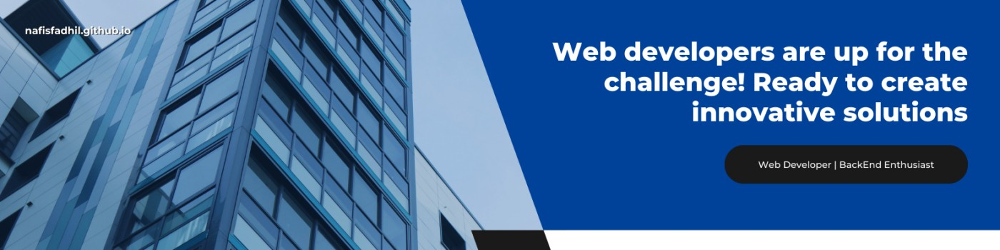

  

###

###

<h2 align="left">👨‍💻 About Me</h2>

###

Hello and welcome to my profile! I am Muhammad Nafis Fadhil, a graduate of SMK Muhammadiyah Bligo with a major in Computer and Network Engineering. Currently, I am pursuing my Informatics Engineering degree at Universitas Dian Nuswantoro (UDINUS), driven by a deep passion for web development.

Throughout my journey, I've gained hands-on experience in various web application projects, which has strengthened my understanding of the web development ecosystem. I aspire to become a dedicated and innovative professional web developer, committed to creating impactful digital solutions.

I believe that web technology has the power to transform the way we live, work, and interact. My goal is to continuously learn, grow, and contribute to the advancement of the field. I'm excited to connect with professionals and peers who share the same enthusiasm for web development, technology, and innovation.

Feel free to reach out if you're interested in collaborating, discussing ideas, or exchanging knowledge. Thank you for visiting my profile!

###

 

<h2 align="left">✨ Skills</h2>

###

  
  
  
  
  
  
  
  
  
  
  
  
  
  
  
  
  
  
  
  
  
  
  
  
  
  
  
  
  

###

<h2 align="left">📊 Stats</h2>

###

 

  
  
  
  
  

###

<h2 align="left">📞 Connect With Me</h2>

###

  
  
  
  

###
